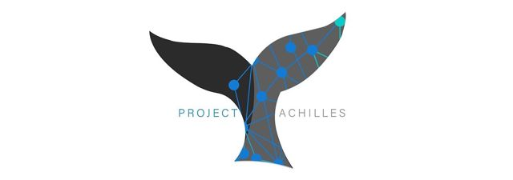

# [WIP]Project Achilles

## Calling Achilles from the Terminal
In your terminal, enter `nano ~/.bash_profile`, then add the line `alias achilles="python3 <path-to-achilles.py>"`
* `achilles analyze <file>` -  analyzes a source file, using the appropriate vulnerability models
* `achilles train <language> <folder> <threshold>` - trains a model on a given directory of example files for a language.
 Achilles will ignore any vulnerability classes that have fewer entries than the provided threshold number.
* `achilles ls <language>` - lists the vulnerability models for a given language.

## Training Achilles
Achilles was designed to make training as simple as passing in a few arguments in the command line. Let's refer to the
command `achilles train <language> <folder> <threshold>`. The language parameter simply lets Achilles know where to store
the data; by convention, all vulnerability models are stored in /data/&lt;language&rt;/checkpoints/. The folder parameter
indicates a target directory for Achilles to train on. This folder should contain files of the specified language for
Achilles to train on. These training files must be named in such a way that the category name and file identifier are
separated by "__", e.g. "CWE369_Divide_by_Zero__float_Environment_divide_52b.java". This example would be lumped together
with all other example files that begin with "CWE369_Divide_by_Zero", and then an individual model of the same name will
be generated using this data. This means that training new models is as simple as passing Achilles a directory with
properly named example files to train on.

Now, to elaborate on what exactly the threshold is; a threshold is simply a value
which tells Achilles how to handle the data. Any vulnerability category that has fewer example files than a given threshold
will be dropped. In general, this prevents overfitting and improves the calculation of various metrics. Methods in the
example files must contain either "good" or "bad" in the method name (corresponding to secure or vulnerable, respectively).
This convention allows Achilles to properly label example methods. Remember, since Achilles redacts the method names upon
training, the actual name of the method isn't too important. The most important thing is to make sure a method contains
either "good" or "bad", otherwise, it will be ignored.

## Building Achilles Support for Other Languages
1. In constants.py, add file extensions to the `languages` dictionary, with the target language as the value.
1. Create a new python file of similar form to javalect.py, fit with functions that parse your language appropriately.
 As input, AchillesRNN takes a sequence of tokens by method; with the method name replaced by a random string of characters.
1. Replace instances of `# Add language support here.` in achilles.py with an elif block, calling the appropriate static
functions for training and predicting.

